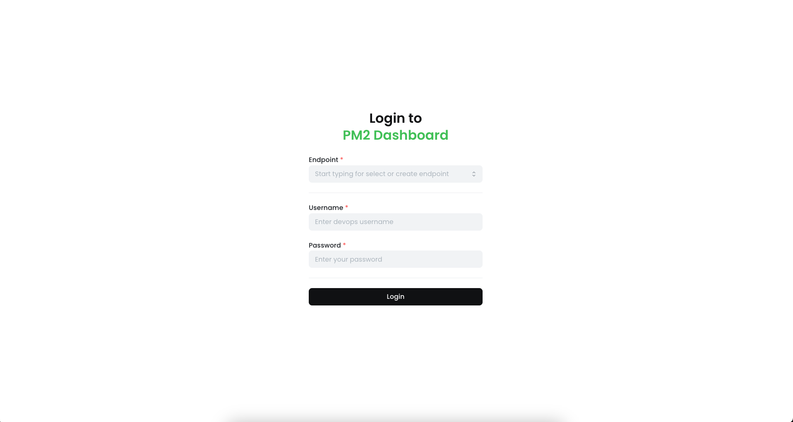
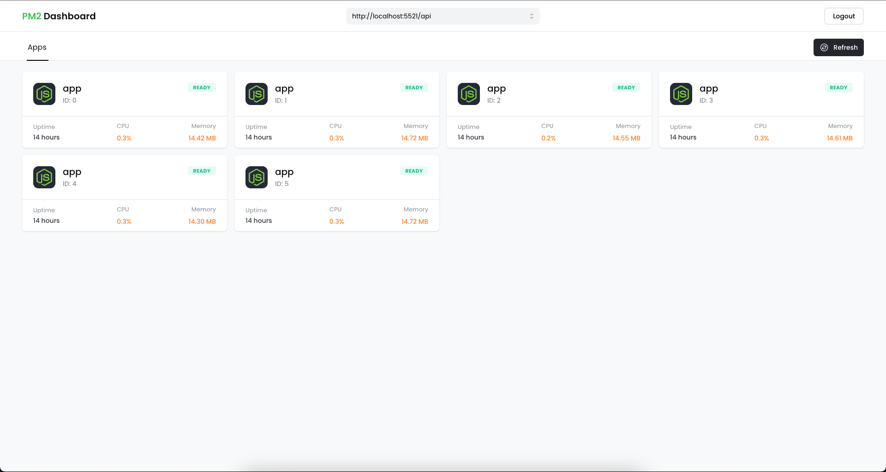
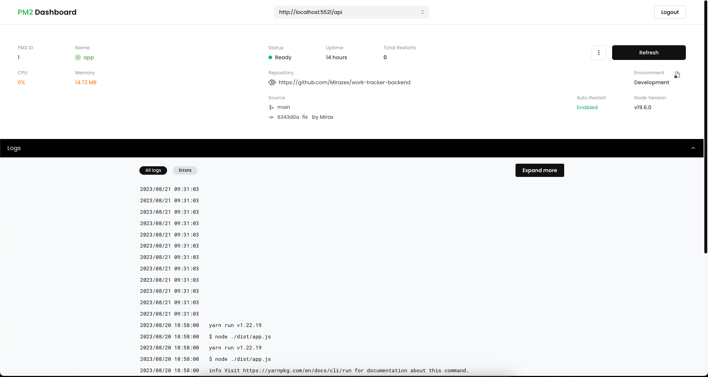

How to use this application

## Requirements
- Node.js - Latest LTS version
- Environment variables - See .env.example
- Have a running backends on remote machine [See here](https://github.com/Mirazex/pm2-dashboard-backend)

## Installation
1. Clone this repository
2. Install the dependencies using `yarn install`
3. Create a `.env` file in the root directory and add the following environment variables:
    ```dotenv
    NEXTAUTH_SECRET="secret"
    # path to this frontend application 
    # example: http://localhost:3000
    NEXTAUTH_URL="http://localhost:3000"
    ```
4. Build the application using `yarn build`
5. Start the application using `yarn start`
6. Open the application in your browser

## Usage
1. Select the backend you want to connect to
2. Login to backend using the login form (using backend admin credentials) 

3. You will be redirected to the dashboard

4. Open the details of an application by clicking on the application card

5. Now you can see the details of the application and manage it